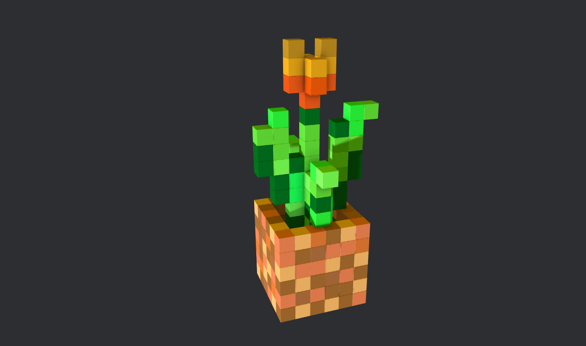
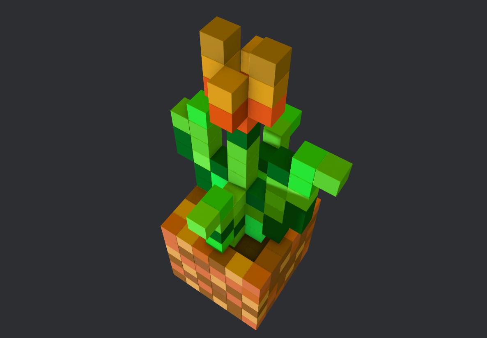

# Minecraft tulip

A 3D Minecraft-style tulip model created using a spline tool.

## Overview

This project features a 3D Minecraft tulip that is generated by using the spline tool technique to recreate the classic blocky style of Minecraft flowers. The design emphasizes cubic simplicity while maintaining an appealing shape that reflects the tulip's characteristic profile.

## Screenshots

  

